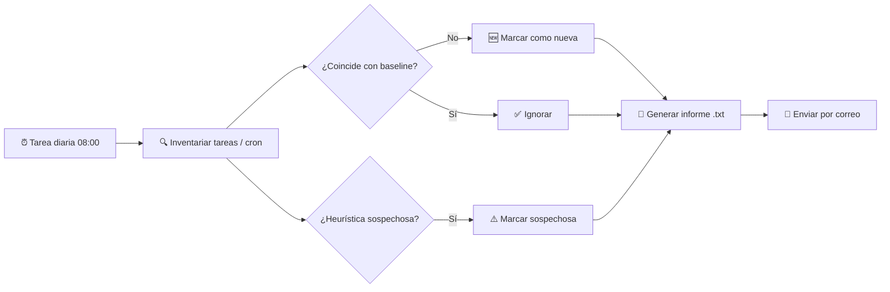

<div align="center">

# 🛡️ Persistence Audit

**Detección diaria de persistencia sospechosa en el Programador de Tareas (Windows) y cron (Linux)**

[](#-linux)
[](#-windows)
[](#-licencia)
[]()
[](#-contribuir)

Un script, un baseline, un informe. Sin agentes, sin dependencias raras, sin nube.

[Instalación](#-instalación-rápida) •
[Cómo funciona](#-cómo-funciona) •
[Configuración](#️-configuración) •
[Programación diaria](#-programar-la-ejecución-diaria) •
[FAQ](#-preguntas-frecuentes)

</div>

---

## 📌 ¿Qué hace?

`persistence-audit` inspecciona los mecanismos de persistencia más usados por
malware, backdoors y C2 —el **Programador de tareas** en Windows y **cron**
en Linux— y te avisa por correo si aparece algo que no debería estar ahí.

- ✅ Compara el estado actual contra un **baseline** que tú apruebas
- ✅ Aplica **heurísticas** de detección (LOLBins, comandos codificados, descargas + ejecución remota, reverse shells...)
- ✅ Extrae **IPs públicas y dominios** referenciados en las tareas
- ✅ Genera un **informe `.txt` legible en 5 segundos**
- ✅ Te lo **envía por correo** cada mañana
- ✅ Cero dependencias externas: Bash + `python3` estándar en Linux, PowerShell nativo en Windows

<div align="center">



</div>

---

## 🚀 Instalación rápida

<table>
<tr>
<td width="50%" valign="top">

### 🐧 Linux

```bash
git clone https://github.com/tu-usuario/persistence-audit.git
cd persistence-audit
chmod +x linux_persistence_audit.sh

# 1) Crea el baseline en un equipo confiable
sudo ./linux_persistence_audit.sh --baseline

# 2) Pruébalo
sudo ./linux_persistence_audit.sh
cat /var/log/persistence-audit/latest_report.txt
```

</td>
<td width="50%" valign="top">

### 🪟 Windows

```powershell
git clone https://github.com/tu-usuario/persistence-audit.git
cd persistence-audit

# 1) Crea el baseline (PowerShell como Administrador)
powershell -ExecutionPolicy Bypass `
  -File .\windows_persistence_audit.ps1 -Baseline

# 2) Pruébalo
powershell -ExecutionPolicy Bypass `
  -File .\windows_persistence_audit.ps1
type C:\ProgramData\PersistenceAudit\reports\latest_report.txt
```

</td>
</tr>
</table>

> ⚠️ Ambos scripts requieren privilegios elevados (**root** / **Administrador**)
> para poder leer el crontab de todos los usuarios o todas las tareas programadas.

---

## 🧠 Cómo funciona

<details>
<summary><b>1. Baseline — el "estado normal" que tú apruebas</b></summary>
<br>

La primera ejecución (`--baseline` / `-Baseline`) guarda un snapshot de todas
las tareas cron / Programador de tareas actuales. Hazlo en un equipo que
consideres limpio. A partir de ahí, cualquier entrada **nueva** que aparezca
se marcará para revisión, aunque no dispare ninguna heurística.

</details>

<details>
<summary><b>2. Heurísticas — patrones típicos de persistencia maliciosa</b></summary>
<br>

| Categoría | Ejemplos detectados |
|---|---|
| LOLBins | `mshta`, `regsvr32 /i:http`, `certutil -urlcache`, `bitsadmin /transfer` |
| Descarga + ejecución | `curl \| bash`, `wget \| sh`, `DownloadString`, `Net.WebClient` |
| Ofuscación | `base64 -d`, `-EncodedCommand` / `-enc`, `IEX` |
| Reverse shells | `/dev/tcp/`, `nc -e`, `bash -i`, `mkfifo` |
| Rutas sospechosas | `%TEMP%`, `\AppData\Local\Temp\`, `/tmp/`, `/dev/shm/`, `\Users\Public\` |

</details>

<details>
<summary><b>3. Extracción de IOCs — IPs y dominios</b></summary>
<br>

Se extraen todas las IPs y dominios mencionados en los comandos, descartando
automáticamente rangos privados (`10.x`, `172.16-31.x`, `192.168.x`,
`127.x`) para quedarte solo con lo que realmente importa: tráfico potencial
hacia infraestructura externa.

</details>

<details>
<summary><b>4. Informe + correo</b></summary>
<br>

Se genera un `.txt` como este:

```
==================================================
  INFORME DE ANÁLISIS DE PERSISTENCIA - LINUX
  Equipo: srv-prod-01
  Fecha:  2026-08-28 08:00:03
==================================================

[OK] El análisis ha sido correcto.
[OK] No se identificó persistencia sospechosa.

Resumen:
  - Entradas cron revisadas ........ 14
  - Nuevas respecto al baseline ..... 0
  - Marcadas como sospechosas ....... 0
  - IPs públicas / dominios hallados  0
==================================================
```

Y se envía por correo con asunto `[OK]` o `[ALERTA]` para que puedas
triarlo de un vistazo sin abrirlo.

</details>

---

## ⚙️ Configuración

Edita las variables al principio de cada script:

```bash
# linux_persistence_audit.sh
SMTP_SERVER="smtp.ejemplo.com"
SMTP_PORT="587"
SMTP_USER="usuario@ejemplo.com"
SMTP_PASS="CAMBIA_ESTA_CONTRASENA"
MAIL_FROM="usuario@ejemplo.com"
MAIL_TO="acasa@ejemplo.com"
SEND_EMAIL=true
```

```powershell
# windows_persistence_audit.ps1
$SmtpServer = "smtp.ejemplo.com"
$SmtpPort   = 587
$SmtpUser   = "usuario@ejemplo.com"
$SmtpPass   = "CAMBIA_ESTA_CONTRASENA"
$MailFrom   = "usuario@ejemplo.com"
$MailTo     = "acasa@ejemplo.com"
$SendEmail  = $true
```

> 🔐 **No subas credenciales reales al repositorio.** Usa una cuenta SMTP
> dedicada de solo envío, variables de entorno, o un gestor de secretos
> (Windows Credential Manager / `pass` / Vault) y adapta el script para
> leer de ahí en lugar de texto plano.

---

## ⏱ Programar la ejecución diaria

<table>
<tr>
<td width="50%" valign="top">

**Linux — crontab de root**

```bash
sudo crontab -e
```
```cron
0 8 * * * /ruta/completa/linux_persistence_audit.sh >> /var/log/persistence-audit/cron.log 2>&1
```

</td>
<td width="50%" valign="top">

**Windows — Programador de tareas**

```powershell
$action = New-ScheduledTaskAction -Execute "powershell.exe" `
  -Argument '-ExecutionPolicy Bypass -File "C:\ruta\windows_persistence_audit.ps1"'
$trigger = New-ScheduledTaskTrigger -Daily -At 08:00
Register-ScheduledTask -TaskName "AuditoriaPersistenciaDiaria" `
  -Action $action -Trigger $trigger -RunLevel Highest -User "SYSTEM"
```

</td>
</tr>
</table>

> 💡 La propia tarea que registres quedará como "nueva" la primera vez que
> se ejecute, a menos que regeneres el baseline después de crearla. No es
> un fallo: es la auditoría detectando su propia instalación.

---

## 📖 Interpretar resultados

| Resultado | Significado | Acción |
|---|---|---|
| `[OK]` sin hallazgos | Todo coincide con el baseline, sin patrones sospechosos | Ninguna |
| `[!] ALERTA` — entrada nueva | Apareció una tarea/cron que no estaba en el baseline | Revisar; si es legítima, regenerar baseline |
| `[!] ALERTA` — sospechosa | Coincide con una heurística de riesgo | Investigar el comando y su origen de inmediato |
| IOC detectado | Hay una IP pública o dominio en una tarea | Comprobar si es tráfico esperado (backups, updates...) |

---

## ❓ Preguntas frecuentes

<details>
<summary><b>¿Esto sustituye a un antivirus o EDR?</b></summary>
<br>
No. Es una capa adicional basada en heurísticas y en diferencias respecto a
un estado conocido. Complementa, no reemplaza, una solución EDR/antivirus.
</details>

<details>
<summary><b>¿Qué pasa si el atacante compromete la cuenta que ejecuta el script?</b></summary>
<br>
Podría intentar manipular el baseline o desactivar el envío de correo. Por
eso es importante restringir permisos de escritura sobre los ficheros de
baseline y considerar enviar los informes también a un sistema centralizado
(SIEM, otro correo, un webhook) fuera del propio equipo.
</details>

<details>
<summary><b>¿Cubre otros mecanismos de persistencia?</b></summary>
<br>
Por ahora solo cron y el Programador de tareas. Está pensado para ampliarse
a claves de registro <code>Run</code>/<code>RunOnce</code>, servicios,
<code>systemd timers</code>, <code>.bashrc</code>/<code>profile.d</code>,
etc. Contribuciones bienvenidas.
</details>

<details>
<summary><b>¿Puedo usar Gmail/Outlook para el envío?</b></summary>
<br>
Sí, pero con 2FA activado necesitarás una "contraseña de aplicación", no la
contraseña normal de la cuenta.
</details>

---

## 🗺 Roadmap

- [ ] Detección de persistencia vía registro de Windows (`Run`/`RunOnce`, servicios)
- [ ] Soporte para `systemd timers` en Linux
- [ ] Salida adicional en formato JSON para integraciones SIEM
- [ ] Firma/checksum del propio script para detectar manipulación
- [ ] Modo "dry-run" con salida a consola sin generar fichero

---

## 🤝 Contribuir

Los *pull requests* son bienvenidos. Para cambios grandes, abre primero un
*issue* explicando qué te gustaría cambiar.

1. Haz un fork del repositorio
2. Crea tu rama (`git checkout -b feature/nueva-heuristica`)
3. Haz commit de tus cambios (`git commit -m 'Añade detección de X'`)
4. Push a tu rama (`git push origin feature/nueva-heuristica`)
5. Abre un Pull Request

---

## ⚖️ Descargo de responsabilidad

Esta herramienta se proporciona "tal cual", con fines defensivos y de
auditoría en sistemas de tu propiedad o sobre los que tienes autorización
expresa. El autor no se hace responsable del uso indebido de este software.

## 📄 Licencia

Distribuido bajo licencia MIT. Consulta [`LICENSE`](LICENSE) para más detalles.

---

<div align="center">

Hecho con 🛡️ para dormir un poco más tranquilo.

</div>
